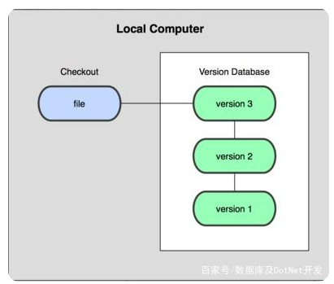
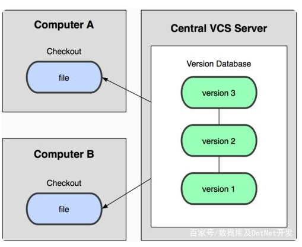
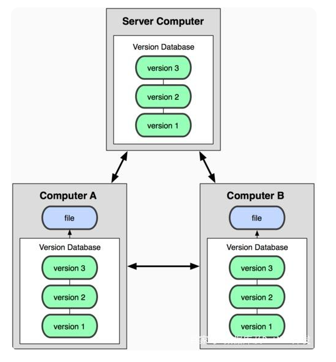
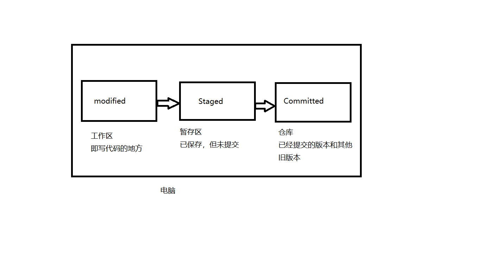
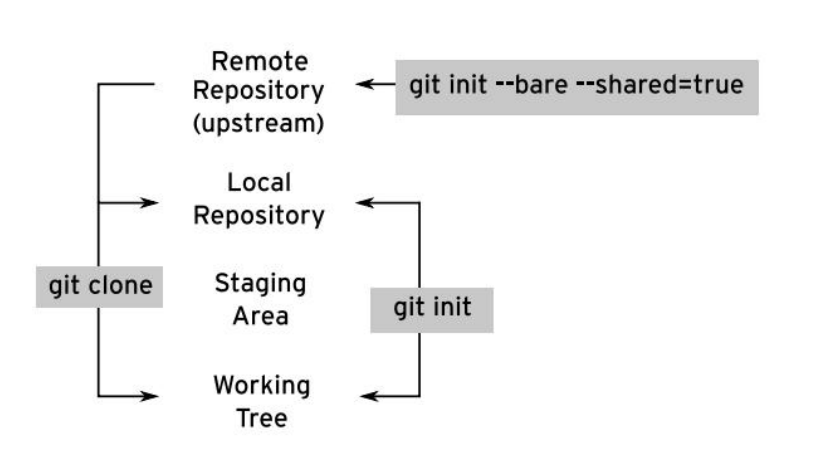
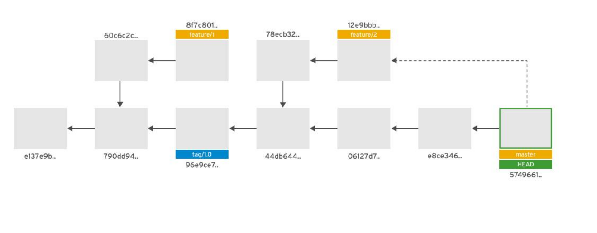

---

---

# git

## 1.简介

一个开源的分布式版本控制系统，可以有效、高速地处理从很小到非常大的项目版本管理。

Git也是目前最流行的分布式版本控制系统，它和其他版本控制系统的主要差别在于Git只关心文件数据的整体是否发生变化，而大多数版本其他系统只关心文件内容的具体差异，这类系统（CVS，Subversion，Perforce，Bazaar 等等）每次记录有哪些文件作了更新，以及都更新了哪些行的什么内容。

### 1.1.git特性

- **分布式**：Git版本控制系统是一个分布式的系统，是用来保存工程源代码历史状态的命令行工具。
- **保存点**：Git的保存点可以追踪源码中的文件, 并能得到某一个时间点上的整个工程项目的状态；可以在该保存点将多人提交的源码合并, 也可以回退到某一个保存点上。
- **Git离线操作性**：Git可以离线进行代码提交，因此它称得上是完全的分布式处理，Git所有的操作不需要在线进行；这意味着Git的速度要比SVN等工具快得多，因为SVN等工具需要在线时才能操作，如果网络环境不好， 提交代码会变得非常缓慢。
- **Git基于快照**：SVN等老式版本控制工具是将提交点保存成补丁文件，Git提交是将提交点指向提交时的项目快照，提交的东西包含一些元数据(作者，日期，GPG等)。
- **Git的分支和合并**：分支模型是Git最显著的特点，因为这改变了开发者的开发模式，SVN等版本控制工具将每个分支都要放在不同的目录中，Git可以在同一个目录中切换不同的分支。
- **分支即时性**：创建和切换分支几乎是同时进行的，用户可以上传一部分分支，另外一部分分支可以隐藏在本地，不必将所有的分支都上传到GitHub中去。
- **分支灵活性**：用户可以随时创建、合并、删除分支，多人实现不同的功能，可以创建多个分支进行开发，之后进行分支合并，这种方式使开发变得快速、简单、安全。

### 1.2.Git优缺点

　　**优点**：

- 适合分布式开发，强调个体。
- 公共服务器压力和数据量都不会太大。
- 离线工作、速度快、灵活。
- 任意两个开发者之间可以很容易的解决冲突

　　**缺点**：

- 不符合常规思维。
- 代码保密性差，一旦开发者把整个库克隆下来就可以完全公开所有代码和版本信息

### 1.3.版本控制由来

**本地版本控制系统**




集中式版本控制工具：CVS、VSS、**SVN**等。



分布式版本控制工具：**Git**、Mercurial、Bazaar、Darcs等。



### 1.4.git的三种状态

- **modified：** 工作树中文件的副本已被编辑，并且与存储库中的最新版本不同。
- **staged：** 已经修改的文件，已添加到已更改文件列表中，以作为一个集合进行提交，但尚未提交。
- **committed：** 已经修改的文件，已提交到本地存储库。



## 2.git初始化

使用git包随附的git-prompt.sh脚本，并将以下行添加到~/.bashrc中：

```shell
source /usr/share/git-core/contrib/completion/git-prompt.sh
export GIT_PS1_SHOWDIRTYSTATE=true
export GIT_PS1_SHOWUNTRACKEDFILES=true
export PS1='[\u@\h \W$(declare -F __git_ps1 &>/dev/null && __git_ps1 " (%s)")]\$ '

```

如果当前目录位于Git工作树中，则改工作树的当前Git分支的名称将显示在括号中。

提示符将提示以下内容：

+ (branch *) 表示在工作树中存在修改的跟踪文件 
+ (branch +) 表示在工作树中存在使用git add修改和暂存的跟踪文件
+ (branch %)表示在工作树中存在未跟踪的文件
+ 组合标记，例如(branch *+)

### 2.1.设置用户全局变量

由于Git用户经常修改多个项目，因此Git会在每次提交时记录用户的姓名和电子邮件地址。这些可以在项目级别定义，也可以为用户设置全局默认值。

git config --global命令控制这些设置，并将设置保存在~/.gitconfig文件中来管理用户所有git项目的默认设置。

```shell
$ git config --global user.name Ricardo_mao
$ git config --global user.email maochaomin2012@163.com
$ git config --global -l
core.editor="D:\Microsoft VS Code\bin\code.cmd" --wait
user.name=Ricardo_mao
user.mail=maochaomin2012@163.com

$ cat ~/.gitconfig
[core]
        editor = \"D:\\Microsoft VS Code\\bin\\code.cmd\" --wait
[user]
        name = Ricardo_mao
        mail = maochaomin2012@163.com

```

> git help

```shell
$ git help
usage: git [--version] [--help] [-C <path>] [-c <name>=<value>]
           [--exec-path[=<path>]] [--html-path] [--man-path] [--info-path]
           [-p | --paginate | -P | --no-pager] [--no-replace-objects] [--bare]
           [--git-dir=<path>] [--work-tree=<path>] [--namespace=<name>]
           [--super-prefix=<path>] [--config-env=<name>=<envvar>]
           <command> [<args>]

These are common Git commands used in various situations:

start a working area (see also: git help tutorial)#开始工作区
   clone             #Clone a repository into a new directory  将存储库克隆到新目录中
   init             # Create an empty Git repository or reinitialize an existing one 创建一个空的Git存储库或重新初始化现有的Git存储库

work on the current change (see also: git help everyday)
   add               # Add file contents to the index  将文件内容添加到索引中
   mv                # Move or rename a file, a directory, or a symlink 移动或重命名文件、目录或符号链接
   restore           # Restore working tree files 恢复工作树文件
   rm                # Remove files from the working tree and from the index  从工作树和索引中删除文件
   sparse-checkout   # Initialize and modify the sparse-checkout 初始化并修改稀疏签出

examine the history and state (see also: git help revisions) #检查历史和现状
   bisect            #Use binary search to find the commit that introduced a bug 使用二进制搜索查找引入错误的提交
   diff              #Show changes between commits, commit and working tree, etc 显示提交、提交和工作树等之间的更改
   grep              #Print lines matching a pattern  打印与图案匹配的线条
   log               #Show commit logs   显示提交日志
   show              #Show various types of objects  显示各种类型的对象
   status            #Show the working tree status  显示工作树状态

grow, mark and tweak your common history
   branch            List, create, or delete branches
   commit            Record changes to the repository
   merge             Join two or more development histories together
   rebase            Reapply commits on top of another base tip
   reset             Reset current HEAD to the specified state
   switch            Switch branches
   tag               Create, list, delete or verify a tag object signed with GPG

collaborate (see also: git help workflows)
   fetch             Download objects and refs from another repository
   pull              Fetch from and integrate with another repository or a local branch
   push              Update remote refs along with associated objects

```

## 3.git工作流

### 3.1.**git clone 命令**

git clone 命令克隆上游存储库，并创建了一个工作树，以便文件目录可以进行修订。

~~~shell
mkdir git-repos && cd git-repos
~~~

通过 SSH 协议以 git 用户身份克隆存储库：

```shell
git clone git@git.lab.example.com:git/my_webservers_DEV.git
```

通过 http 方式克隆存储库：

```shell
git clone  http://git.lab.example.com:8081/git/my_webservers_DEV.git
```

### 3.2.git init

开发人员通常需要 使用 git init 命令 ，在本地创建了一个具有工作树的非裸仓库，对工作树来进行更改，以便更改完成后推送到远程仓库。



Git 服务器不需要工作树 ，因此可以使用命令 git init --bare 在服务器上创建一个 没有 本地工作树裸仓库。

```shell
 ssh git@git.lab.example.com 
-sh-4.2$ pwd
/var/opt/gitlab/git-data/repositories
-sh-4.2$ cd git
-sh-4.2$ git init my_webservers_TEST.git --bare

```

**客户端克隆**

```shell
git clone  git@git.lab.example.com:git/my_webservers_TEST.git
```

### 3.3.git status

开发人员在工作树中创建新文件或修改现有文件，工作树更改为 dirty 状态。
git status 命令显示有关工作树中哪些文件已修改但未暂存，未跟踪（新）或已暂存以进行下一次提交的详细信息。

```shell
[student@workstation git-repos]$ cd my_webservers_DEV/

[student@workstation my_webservers_DEV (master)]$ git status

[student@workstation my_webservers_DEV]$ echo hello1 >> apache-setup.yml

[student@workstation my_webservers_DEV (master *)]$ git status

[student@workstation my_webservers_DEV (master *)]$ touch hello.yml

[student@workstation my_webservers_DEV (master *%)]$ git status

```

### 3.4.git add

git add 命令暂存文件，准备将其提交。在下一次提交时，只有暂存到 staged 域的文件才保存到存储库中。如果用户同时处理两个更改，则可以将文件组织为两个提交，以更好地跟踪更改。

```shell
[student@workstation my_webservers_DEV (master *%)]$ git add apache-setup.yml 

[student@workstation my_webservers_DEV (master +%)]$ git status

[student@workstation my_webservers_DEV (master +%)]$ git add -A

[student@workstation my_webservers_DEV (master +)]$ git status

```

### 3.5.git rm

如果用户不想提交 staged 中文件，可以使用 git rm 命令删除 staged 中文件。

```shell
[student@workstation my_webservers_DEV (master +)]$ git rm hello.yml 
error: the following file has changes staged in the index:
 hello.yml
(use --cached to keep the file, or -f to force removal)
```

首先删除 stage 中文件，然后删除目录中文件。

```shell
[student@workstation my_webservers_DEV (master +)]$ git rm hello.yml --cached

[student@workstation my_webservers_DEV (master +%)]$ git status

[student@workstation my_webservers_DEV (master +%)]$ rm hello.yml 

[student@workstation my_webservers_DEV (master +)]$ git status

```

也可以使用 -f 选项，一次性删除。

```
[student@workstation my_webservers_DEV (master +)]$ touch hello.yml

[student@workstation my_webservers_DEV (master +%)]$ git add -A

[student@workstation my_webservers_DEV (master +)]$ git rm hello.yml -f

[student@workstation my_webservers_DEV (master +)]$ git status 

[student@workstation my_webservers_DEV (master +)]$ ls hello.yml

```

### 3.6.git reset

git reset 命令 清空 staged 中跟踪的 文件 ，包括修改的文件 。此命令对工作树中文件的内容无效。

```shell
[student@workstation my_webservers_DEV (master +)]$ git reset
[student@workstation my_webservers_DEV (master *)]$ tail -2 apache-setup.yml 
 enabled: yes
hello1
[student@workstation my_webservers_DEV (master *)]$ git status
```

### 3.7.git commit

**git commit** 命令将 **staged** 中的文件提交到本地 **Git** 存储库。 提交时 必须提供一条日志消息，解释为什么保存当前暂存文件集。不提供消息将中止提交。日志消息不必很长，但是它们应该有意义，这样才有用。

```
[student@workstation my_webservers_DEV (master *)]$ git add -A
[student@workstation my_webservers_DEV (master +)]$ git commit -m 'append 
hello1 to apache-setup.yml'
[master e7ff4dd] append hello1 to apache-setup.yml
 1 file changed, 1 insertion(+)
[student@workstation my_webservers_DEV (master)]$ 
```

**git  commit  -a** 命令一次性完成 **add** 和**commit** 两个操作。但是， 该命令不会提交任何未跟踪（新创建）的文件。 添加新文件时，必须使用命令 **git add** 显示 地指明添加的文件，以便在 **git commit -a** 命令中对其进行跟踪。

```
[student@workstation my_webservers_DEV (master)]$ echo hello2 >> apache-setup.yml 

[student@workstation my_webservers_DEV (master *)]$ touch hello2

[student@workstation my_webservers_DEV (master *%)]$ git add hello2 

[student@workstation my_webservers_DEV (master *+)]$ git commit -a -m 'create new file 

hello2 and append hello2 to apache-setup.yml'

```

有意义且简洁的提交消息是 **Ansible** 项目维护清晰历史记录的关键。

提交良好消息的方法有很多，但是大多数方法在以下三点上达成了共识：

+ 第一行应该是提交原因的简短摘要（通常少于 50 个字符）。

+ 接下来是一个空白行，然后消息的其余部分必须说明所有详细信息和提交原因。

+ 如果可用，请添加对问题或功能跟踪器相关条目的引用。 引用其他文本，相关人员或历史记录扩展了提交消息。

### 3.8. git push

在Git 推送之前，必须定义默认的 **push** 方法。 以下命令将默认的 push 方法设置为 **simple**方法。 对于初学者来说，这是最安全的选择。

```
[student@workstation my_webservers_DEV (master)]$ git config --global push.default 
simple
```

**git push** 命令将对本地存储库所做的更改上载到远程存储库。

```
[student@workstation my_webservers_DEV (master)]$ git push
```

提示：执行 **git push** 前必须确保远端存储库存在该项目。

本地创建的非裸仓库如何上传到远端仓库呢？

```shell
[student@workstation git-repos]$ git init test && cd test

[student@workstation test (master #)]$ git remote add origin http://git.lab.example.com:8081/git/test.git

[student@workstation test (master #)]$ touch f1

[student@workstation test (master #%)]$ git add .

[student@workstation test (master +)]$ git commit -m 'create new file f1'

```

上传时，同时在远端仓库创建对应分支。

```shell
[student@workstation test (master)]$ git push --set-upstream origin master
```

### 3.9.git pull

git pull 命令从远程存储库获取提交，并将其合并到您的工作树中。
应该经常运行此命令，以使其他人对远程存储库中的项目所做的更改保持最新。

```shell
[student@workstation ~]$ mkdir git-repos2 && cd git-repos

[student@workstation git-repos2]$ git clone  http://git@git.lab.example.com:8081/git/test.gi t

[student@workstation test (master)]$ echo hello f1 > f1

[student@workstation test (master *)]$ git commit -a -m 'appent line f1 to f1'

[student@workstation test (master)]$ git push

```

原先本地仓库获取最新版本

```
[student@workstation test (master)]$ git pull
[student@workstation test (master)]$ cat f1
hello f1
```

### 3.10.git log

git log 命令 会按提交时间列出当前分支所有的更新，最近的更新排在最上面。每次更新都有一个SHA-1 校验和、作者的名字和电子邮件地址、提交时间，最后缩进一个段落显示提交说明。

```basic
[student@workstation my_webservers_DEV (master)]$ git log 
commit 01a31cfc619d4e68cc8de6f75c913dcc2ed8a8f6 (HEAD -> master, origin/master, 
origin/HEAD)
Author: Git Lab <git@lab.example.com>
Date: Tue Jul 20 08:14:51 2021 +0800
 create new file hello2 and append hello2 to apache-setup.yml ...... 使用 --all 选项，显示所有日志。默认只显示当前提交之前的日志。
[student@workstation my_webservers_DEV]$ git log --all
```

### 3.11.git show

git show COMMIT-ID 命令显示特定提交哈希在更改集中所包含的内容。 COMMIT-ID ，不需要使用完整的散列，输入的散列 ID 可唯一地标识存储库中的特定提交即可。

```basic
[student@workstation my_webservers_DEV (master)]$ git show 01a31cfc6
commit 01a31cfc619d4e68cc8de6f75c913dcc2ed8a8f6 (HEAD -> master, 
origin/master, origin/HEAD)
Author: Git Lab <git@lab.example.com>
Date: Tue Jul 20 08:14:51 2021 +0800
 create new file hello2 and append hello2 to apache-setup.yml
diff --git a/apache-setup.yml b/apache-setup.yml
index 2a7ee65..f93a845 100644
--- a/apache-setup.yml
+++ b/apache-setup.yml
@@ -54,3 +54,4 @@
 state: restarted
 enabled: yes
 hello1
+hello2
diff --git a/hello2 b/hello2
new file mode 100644
index 0000000..e69de29
```

### 3.12.git revert

git revert COMMIT-ID 命令创建一个新的提交，并将当前内容回滚到特定提交。

```basic
[student@workstation my_webservers_DEV (master)]$ git revert --no-edit HEAD
[master 5604f13] Revert "create new file hello2 and append hello2 to apache-setup.yml"
 Date: Tue Jul 20 09:05:30 2021 +0800
 2 files changed, 1 deletion(-)
 delete mode 100644 hello2
[student@workstation my_webservers_DEV (master)]$ ls
apache-setup.yml templates
[student@workstation my_webservers_DEV (master)]$ tail -n 2 apache-setup.yml 
 enabled: yes
hello1
--no-edit ，选项 不打开编辑输入消息。
```

## 4.GIT 分支和引用

git 仓库中的变更通过 commit 提交，每个提交都包含了 Git 处理该提交需要的所有信息 :

- 提交的唯一 ID ，格式为 40 个十六进制字符串。 此ID 是提交内容的 SHA-1 哈希。

- 已更改的存储库文件列表，并且每个文件的确切更改。 更改可能是行的增加或减少，重命名或删除。

- 父提交的 ID 。 也就是说，在应用当前提交更改之前，提交的 ID 定义了存储库的状态。

- 提交的作者和创建者（或提交者 committer ）。 

- 最后，也是非常重要的，提交还包括引用（ references ）列表。引用就像指向提交的命名指针。 最常见的引用是标签（ tags ）和分支（ branches ）。



### 4.1.创建 分支

```
[student@workstation my_webservers_DEV (master)]$ git branch 
developer
```

列出本地分支，当前分支用 *标记

```
[student@workstation my_webservers_DEV (master)]$ git branch 
 developer
* master
```

### 4.2.查看分支

- git branch -r ，查看远程版本库的分支列表。

- git branch -a ，查看所有分支列表，包括本地和远程。

- git branch -vv ，可以查看本地分支对应的远程分支。

- git branch -v ，查看一个分支的最后一次提交。

- git branch --merged 查看哪些分支已经合并到当前分支。

- git branch --no-merged 查看哪些分支未合并到当前分支。

### 4.3.移动 HEAD

```SAS
[student@workstation my_webservers_DEV (master)]$ git checkout developer
Switched to branch 'developer'
[student@workstation my_webservers_DEV (developer)]$ git branch
* developer
 master
[student@workstation my_webservers_DEV (developer)]$ echo developer1 >> apache-setup.yml
[student@workstation my_webservers_DEV (developer *)]$ git add -A
[student@workstation my_webservers_DEV (developer +)]$ git commit -m 'append line 
developer1 to apache-setup.yml'
[student@workstation my_webservers_DEV (developer)]$ git push
[student@workstation my_webservers_DEV (developer)]$ git push --set-upstream origin 
developer
```

### 4.4.使用旧的提交创建分支

还可以使用 git checkout COMMIT-ID ，将 HEAD 引用移动到特定 COMMIT-ID 提交。
例如，命令 git checkout e7ff4dd21d 将HEAD 引用移动到该提交。

```
[student@workstation my_webservers_DEV (developer)]$ git checkout e7ff4dd21d
```

使用 git branch BRANCH-NAME 创建一个新分支和 git checkout BRANCH-NAME 切换到该分支

```
[student@workstation my_webservers_DEV ((e7ff4dd...))]$ git branch test
[student@workstation my_webservers_DEV ((e7ff4dd...))]$ git checkout test
```

您也可以通过运行 git branch -b BRANCH-NAME 命令来创建分支并切换至该分支

```
[student@workstation my_webservers_DEV (test)]$ git checkout -b test2
```

### 4.5.给commit 打标签

git tag 可以 给某个提交贴上一个标签（例如， 1.0 ），运行 git checkout tag-id 命令切换。

```shell
[student@workstation my_webservers_DEV (test2)]$ git checkout e7ff4dd21d

[student@workstation my_webservers_DEV ((e7ff4dd...))]$ git tag 1.0

[student@workstation my_webservers_DEV ((1.0))]$ git checkout 1.0

HEAD is now at e7ff4dd append hello1 to apache-setup.yml......

[student@workstation my_webservers_DEV ((1.0))]$ 

```

### 4.6.查看分支树

准备环境

```
[student@workstation my_webservers_DEV (developer)]$ echo developer 2 >> apache-
setup.yml 
[student@workstation my_webservers_DEV (developer *)]$ git commit -a -m 'append line 
developer2 to apache-setup.yml'
[student@workstation my_webservers_DEV (developer)]$ git push
[student@workstation my_webservers_DEV (developer)]$ git checkout master
[student@workstation my_webservers_DEV (master)]$ echo hello3 >> apache-setup.yml 
[student@workstation my_webservers_DEV (master *)]$ git commit -a -m 'append line hello3 
to apache-setup.yml'
[student@workstation my_webservers_DEV (master)]$ git push
```

